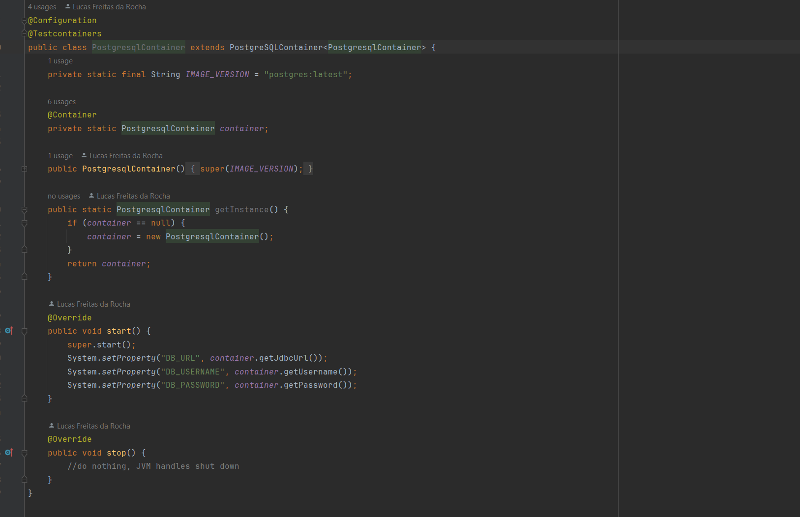
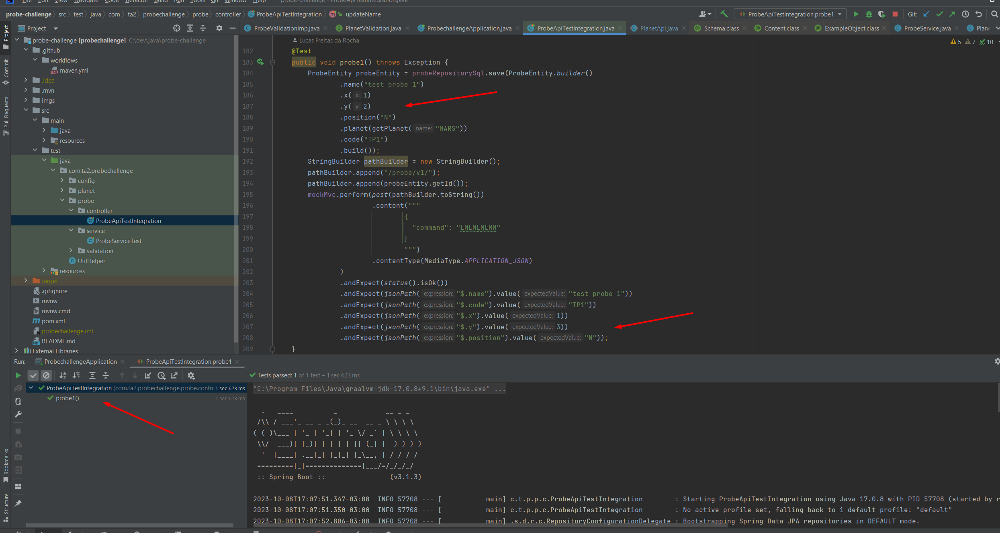
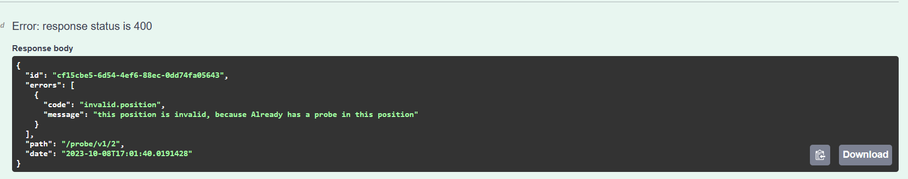
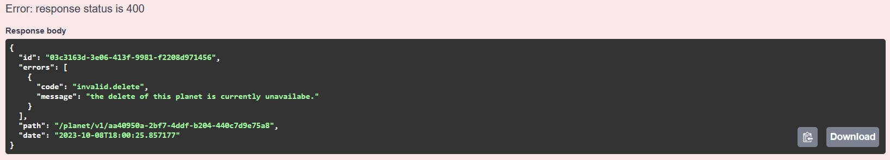

# Probes on Planets Challenge

How the challenge works:

Imagine a developer received a task from a person on the product team. The product team member wanted to be able to control probes on other planets through commands. To explain the product's functionality, the following example was written on a piece of paper:

## Explanation of the Need:

    Planet area size: 5x5
    Landing position of probe 1: x=1, y=2 pointing North Command sequence: LMLMLMLMM
    Final position of probe: x=1 y=3 pointing North
    Landing position of probe 2: x=3, y=3 pointing East Command sequence: MMRMMRMRRML
    Final position of probe: x=5 y=1 pointing North

## Details about the above operation:

The command sequence is a set of instructions sent from Earth to the probe, where:

    M -> Move forward one position in the current direction.
    L -> Turn the probe to the left (90 degrees).
    R -> Turn the probe to the right (90 degrees).

The probe's orientation within the Cartesian plane uses cardinal directions as a reference:

## Resources Used

### Swagger

To facilitate interaction with the API, Swagger has been included in the application. Swagger is an interface description language for describing RESTful APIs expressed using JSON.
To learn more, [visit](https://swagger.io/)

## SOLID and Patterns

The project applied the concept of [SOLID](https://www.digitalocean.com/community/conceptual-articles/s-o-l-i-d-the-first-five-principles-of-object-oriented-design) to improve its writing and maintenance.

For example, an adapter for communication with the SQL database was implemented, so the domain (services and use cases) does not communicate directly with the class that implements JPA for PostgreSQL. This is done to make it easier to switch to MongoDB or another NoSQL database in the future.

Using the adapter ensures that the project has low coupling (dependency).

testcontainers
To perform integration tests, the testcontainers library was used to start a PostgreSQL database container.
[Configuration](../src/test/java/com/ta2/probechallenge/config/PostgresqlContainer.java) class to start the container.

This allows me to simulate end-to-end flow and test all scenarios. To learn more about [testcontainers](https://testcontainers.com/)

Another site that can help understand visit

### [Scenario test classes](../src/test/java/com/ta2/probechallenge/probe/controller/ProbeApiTestIntegration.java)

#### First probe scenario:

Remembering the scenario

    Landing position of probe 1: x=1, y=2 pointing North Command sequence: LMLMLMLMM
    Final position of probe: x=1 y=3 pointing North

Test:

#### Second probe scenario:
Remembering the scenario:

    Landing position of probe 2: x=3, y=3 pointing East Command sequence: MMRMMRMRRML
    Final position of probe: x=5 y=1 pointing North

Test:

### In the next scenarios, I will show the images in Swagger, but they are also covered by the tests

#### Scenario where the command leaves the probe at position 00

Remembering the scenario:

    Do not let any probe stop at position [0,0] because this position is for landing probes on the planet

Test:

#### Scenario where the command leaves the probe outside the allowed area

Remembering the scenario:

    Do not let any probe go beyond the allowed area of the planet

Test:

#### Scenario where the command leaves the probe in a position that already has a probe

Remembering the scenario:

    Do not let two probes be in the same position, remembering that the probe can have zero displacement
    (return to the same position)

Test:

### Scenario where the planet cannot be deleted

Remembering the scenario:

    Do not let delete the planet when there are probes on it

Test:

### Other scenarios are described [here](https://github.com/users/LucasFreitasRocha/projects/1)

