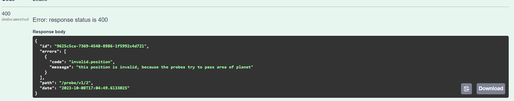

# Desafio das sondas nos planetas

## Explicação basica

Como funciona o  desafio:

Imagine que um desenvolvedor recebeu uma tarefa de uma pessoa da equipe de produto. A pessoa de produto queria poder controlar sondas em outros planetas por meio de comandos. Para explicar o funcionamento do produto, o seguinte exemplo foi escrito em um pedaço de papel:

### Explicação da necessidade:

    Tamanho da área do planeta : 5x5
    Posição de pouso da sonda 1: x=1, y=2 apontando para Norte Sequencia de comandos: LMLMLMLMM
    Posição final da sonda: x=1 y=3 apontando para Norte
    Posição de pouso da sonda 2: x=3, y=3 apontando para Leste Sequencia de comandos: MMRMMRMRRML
    Posição final da sonda: x=5 y=1 apontando para Norte
###  Detalhes sobre o funcionamento acima:

A sequência de comandos é um conjunto de instruções enviadas da terra para a sonda, onde :
   
    M -> Andar para a frente na direção que está 1 posição.
    L -> Virar a sonda para a esquerda (90 graus)
    R -> Virar a sonda para a direita (90 graus)
    
A orientação da sonda dentro do plano cartesiano usa uma rosa-dos-ventos como referência:

## Recursos utilizados

### Swagger

Para facilitar a interação com a api foi incluido o swagger na aplicação. O Swagger é uma linguagem de descrição de interface para descrever APIs RESTful expressas usando JSON.
Para saber mais [acesse](https://swagger.io/)

### SOLID e partens 
    
No projeto foi aplicado o conceito de [solid](https://medium.com/desenvolvendo-com-paixao/o-que-%C3%A9-solid-o-guia-completo-para-voc%C3%AA-entender-os-5-princ%C3%ADpios-da-poo-2b937b3fc530) 
para melhorar a esricta e manutenção do mesmo;

Exemplo foi o adapter de comunição com o banco de dados sql, não fazendo o dominio (services e useCases) se comunicar
diretamente com a classe que implementa jpa do postgress. Isso serve para que se no futuro eu queira trocar para o mongo
ou outro banco noSql seja mais facil a troca.

Utilizar o adapter faz com o que o projeto tenha baixo acomplamento(depdencia).

### testcontainers

Para fazer os testes de integração utilizei a biblioteca testcontainers para subir um container do banco de dados postgree
a [classe de configuração](../src/test/java/com/ta2/probechallenge/config/PostgresqlContainer.java) para subir o container;

Com isso consigo simular o fluxo de ponta a ponta e testar todos os cenarios, para saber mais sobre [testcontainers](https://testcontainers.com/)

Outro site que pode ajudar a entender [acesse](https://medium.com/dev-cave/testes-de-sistema-com-testcontainers-be07ff7deec6)

#### [classes de testes dos cenarios](../src/test/java/com/ta2/probechallenge/probe/controller/ProbeApiTestIntegration.java)

#### Cenario primeira sonda:

Lembrando o cenario

    Posição de pouso da sonda 1: x=1, y=2 apontando para Norte Sequencia de comandos: LMLMLMLMM
    Posição final da sonda: x=1 y=3 apontando para Norte

Teste:

#### Cenario segunda sonda:

Lembrando o cenario:

    Posição de pouso da sonda 2: x=3, y=3 apontando para Leste Sequencia de comandos: MMRMMRMRRML
    Posição final da sonda: x=5 y=1 apontando para Norte

Teste:

### Nos proximos cenarios irei mostrar as imagens no swagger, mas está coberto pelos testes também

#### Cenario que o comando deixa a sonda na posição 00

Lembrando o cenario:
    
    Não deixar nenhuma sonda parar na posição [0,0] , pois está posição é para pousar as sondas no planeta

Teste:
    

#### Cenario que o comando deixa a sonda fora area permitida

Lembrando o cenario:

    Não deixar nenhuma sonda ir além da area permitida do planeta

Teste:

#### Cenario que o comando deixa a sonda numa posição que já tem uma sonda
Lembrando o cenario:

    Não deixa duas sondas na mesma posição, lembrando que a sonda pode ter deslocamento zero 
    (voltar para a mesma posição)

Teste:

#### Cenario que não pode deletar o planeta
Lembrando o cenario:

    Não deixa delatar o planeta quando tiver sondas nele

Teste:

#### Demais cenario está descrito [aqui](https://github.com/users/LucasFreitasRocha/projects/1)

    

